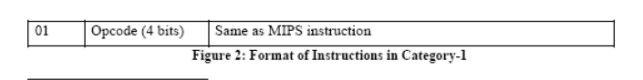
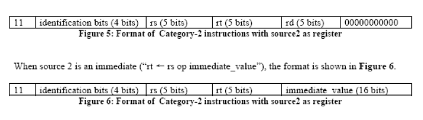
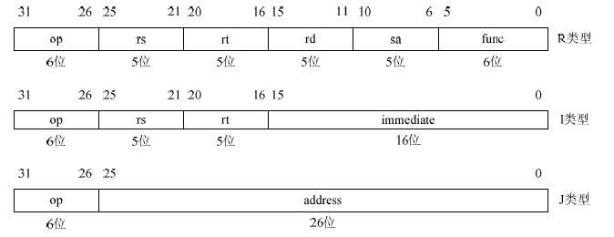

# mips-simulator

## 任务描述

* 1.载入一个MIPS文件，生成与输入文件等效的汇编代码

* 2.通过指令模拟MIPS代码生成指令。它还应该在执行每个指令后生成/打印寄存器和数据存储器的内容。请参见示例模拟输出文件。
    * sample.txt:输入文件
    * simulation.txt:寄存器和数据存储器的内容变化情况
    * disassembly.txt:汇编代码

## 指令描述
1.Category-1

| 指令|编码 |
| :---|---:|
|J|0000|
|JR|0001|
|BEQ| 0010|
|BLTZ|0011|
|BGTZ|0100|
|BREAK|0101|
|SW|0110|
|LW|0111|
|SLL|1000|
|SRL|1001|
|SRA|1010|
|NOP|1011|

2.Category-2

| 指令|编码 |
| :---|---:|
|ADD|0000|
|SUB|0001|
|MUL| 0010|
|AND|0011|
|OR|0100|
|XOR|0101|
|NOR|0110|
|SLT|0111|
|ADDI|1000|
|ANDI|1001|
|ORI|1010|
|XORI|1011|

## MIPS32架构指令格式

MIPS32架构中所有指令都是32位的，op是指令码，func是功能码

（1）R类型：具体操作由op、func结合指定，rs和rt是源寄存器的编号，rd是目的寄存器的编号，比如：假设目的寄存器是$3，那么对应的rd就是00011（此处是二进制）。MIPS32架构中有32个通用寄存器，使用5位编码就可以全部表示，所以rs、rt、rd的宽度都是5位。sa只有在移位指令中使用，用来指定移位位数。

（2）I类型：具体操作由op指定，指令的低16位是立即数，运算时要将其扩展至32位，然后作为其中一个源操作数参与运算。

（3）J类型：具体操作由op指定，一般是跳转指令，低26位是字地址，用于产生跳转的目标地址。